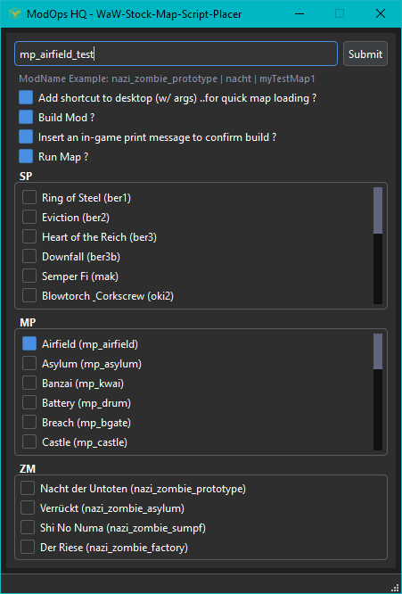

# WaW Stock Map Script Placer

A tool for creating custom Stock Map - Mods.
It essentially just drops a base set of files into a specific folder structure.
Said base files are extracted from the stock .ff files located in waw_root/zone/english so you can download my base_files.zip file or extract the ff's yourself. Just be sure to create these subdirs (sp, mp, zm) in the _internal/base_files folder, then place your extracted ff's into the game-mode subdirs i.e _internal/base_files/sp/ber1, ber2, etc. Be sure to drop mapname_patch into mapname & replace all, then mapname_load into mapname & replace all. The tool only looks out for _internal/base_files/*mode*/*mapname*, not _patch nor _load so ensure you merge them all in correct order.

# Installation

- Download WaW-Stock-Map-Script-Placer.zip
- Extract WaW-Stock-Map-Script-Placer.zip

- Download base_files.zip
- Extract base_files.zip

- Open WaW-Stock-Map-Script-Placer folder
- Drop base_files folder into _internal folder

# Usage

Go into _internal folder, then into json folder, open config.json and replace the directory with your own waw root directory.

Run WaW-Stock-Map-Script-Placer.exe

Input mod name

Decide whether you want (all of these options are optional):
- A waw exe shortcut sent to your desktop with predefined args so you can load right into map via running said shortcut.
- the mod built/compiled, it does the same thing as the stock launcher.
- insert an in-game print message to confirm build. this will just add a few lines of code to mapname.gsc so when you run the map it will print a message which will indicate that the build was successful. if you check build mod, as well as this option, but dont see the in-game print message, then the build failed.
- automatically have the map run after mod has been created.

Select one of the maps in the mode-specific sections.

# License

GNU Lesser General Public License Version 3

# Screenshot

# Video

https://youtu.be/-cfac1ugllk

# Creator

Price (a.k.a phil81334)

# Socials

[ModOpsHQ](https://modopshq.com) || [Discord](https://discord.gg/SEkBECkt2Q) || [YouTube](https://www.youtube.com/@modopshq) || [X](https://x.com/modopshq)